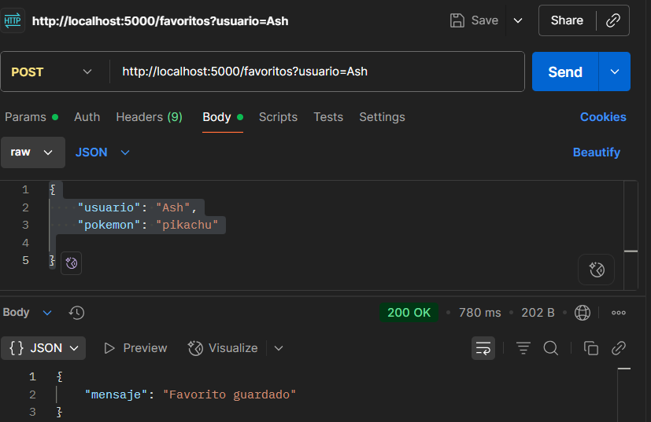

## Horóscopo Pokémon - API Flask
### Descripción
API en Flask para buscar Pokémon, guardar favoritos y obtener tu Pokémon según tu horóscopo.

### Cómo ejecutar
#### Opción 1- Ejecutar con Docker:
1. Clonar el repositorio                      
git clone <URL_DEL_REPOSITORIO>                       
cd RETO1

2. Levantar el contenedor:                    
docker-compose up --build
#### Opción 2- Ejecutar sin Docker:
1. Clonar el repositorio
git clone <URL_DEL_REPOSITORIO>         
cd RETO1/app

2. Ejecutar localmente:                   
pip install flask requests                
cd RETO1/app                   
python main.py

### EndPoints

Una vez ejecutado, debemos ingresar a esta aplicación
para empezar a poder guardar, buscar, eliminar pokemones, 
lo haremos de la siguiente manera:

1. Ingresar a la aplicación
2. Creamos una nueva petición
3. Para poder devolver, por ejemplo, el pokemón que corresponde
al signo zodiacal debemos hacer:

Primero ingresar POST (que envía datos al servidor para que haga algo con ellos)             
Luego, ingresar esta URL:http://localhost:5000/horoscopo                                 
Por último, en "Body", pondremos "raw", donde automaticamente
se configura con Json y escribiremos:
"{            "nombre": "Ash",
  "fecha_nacimiento": "1990-05-15"
}"                                 
Finalmente, clickeamos "Send" y deberia aparecer lo siguiente:

4. Luego, para guardar favoritos, usaremos POST, con este URL:     
http://localhost:5000/favoritos?usuario=Ash

Luego en "Body", pondremos:
{
    "usuario": "Ash",
    "pokemon": "pikachu"
}                          
Finalmente, clikeamos "Send" y deberia aparecernos:

5. Para obtener los favoritos, solamente (del paso anterior) cambiamos de POST
a GET y clikeamos "Send", debería responder:

6. Si deseamos eliminar un pokemon de nuestra lista de favoritos, usaremos
DELETE con el mismo URL anterior y en "Body" pondremos:
{
    "usuario": "Ash",
    "id": 1
}                              
   (Esta id es 1, ya que esta predefinida así), clickeamos "Send" y debería aparecer:

Si quisieramos obtener nuevamente la lista, que ahora estará vacía ya que, 
eliminamos al único favorito de nuestra lista, únicamente debemos nuevamente poner GET, dejando
la misma URL y Body, clickeamos "Send" y debería aparecernos:

